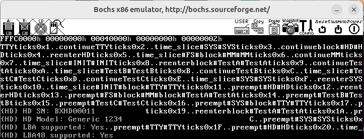
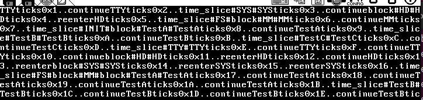

时钟中断中会出现中断重入现象， 而进程调度程序在遇到中断重入时会停止调度。

接下里分析一下，为什么会在时钟中断会中断重入，也即时钟中断是在哪一个中断中发生的，以及为什么要直接返回而不进行进程调度。

先分析一下中断过程。
中断可以分为中断与异常，
由外部引发的时钟中断，键盘中断以及int n调用产生的内部中断例如系统调用。
cpu执行出现的异常，如除零错误，eip错误等。

## 外部中断

时钟中断等外部中断都是在以下这个宏的基础上。

```asm
%macro	hwint_slave	1
	call	save
	in	al, INT_S_CTLMASK	; `.
	or	al, (1 << (%1 - 8))	;  | 屏蔽当前中断
	out	INT_S_CTLMASK, al	; /
	mov	al, EOI			; `. 置EOI位(master)
	out	INT_M_CTL, al		; /
	nop				; `. 置EOI位(slave)
	out	INT_S_CTL, al		; /  一定注意：slave和master都要置EOI
	sti	; CPU在响应中断的过程中会自动关中断，这句之后就允许响应新的中断
	push	%1			; `.
	call	[irq_table + 4 * %1]	;  | 中断处理程序
	pop	ecx			; /
	cli
	in	al, INT_S_CTLMASK	; `.
	and	al, ~(1 << (%1 - 8))	;  | 恢复接受当前中断
	out	INT_S_CTLMASK, al	; /
	ret
%endmacro

```
### 中断入口

可以看到中断触发后，首先是执行的save函数，这个函数会将一些段寄存器切换为内核态，是为了不破坏进程中的数据。该函数也非常重要，会在下面在进行介绍。

### 屏蔽当前中断

之后会屏蔽掉当前的硬件中断，意义在于当我们运行时钟中断或键盘中断处理程序时，不会再触发时钟中断。如果不关闭掉这个中断，且时钟中断中的代码处理时间过长，则会在时钟中断中继续触发时钟中断进行嵌套。

在我没有仔细阅读这段代码之前，我以为时钟中断中的防中断重入是为了防止时钟中断。错误的理解为了如果进程调度花费的时间超过一个时钟周期，再次进入时钟中断时不需要进程调度。


但实际上硬件中断在处理的时候会屏蔽掉当前中断，在执行完中断处理函数之后才会再次允许中断。也即对于自身中断是不会嵌套的，中断的嵌套只能是不同中断之间的嵌套。

### 中断重入  

中断重入机制不是所有系统都有的，有的系统是不允许中断重入的，同时cpu默认是会主动关闭中断的。要允许中断重入需要在中断处理中开启中断响应。


### save函数


```asm
save:
        pushad          ; `.
        push    ds      ;  |
        push    es      ;  | 保存原寄存器值
        push    fs      ;  |
        push    gs      ; /

	;; 注意，从这里开始，一直到 `mov esp, StackTop'，中间坚决不能用 push/pop 指令，
	;; 因为当前 esp 指向 proc_table 里的某个位置，push 会破坏掉进程表，导致灾难性后果！

	mov	esi, edx	; 保存 edx，因为 edx 里保存了系统调用的参数
				;（没用栈，而是用了另一个寄存器 esi）
	mov	dx, ss
	mov	ds, dx
	mov	es, dx
	mov	fs, dx

	mov	edx, esi	; 恢复 edx

        mov     esi, esp                    ;esi = 进程表起始地址

        inc     dword [k_reenter]           ;k_reenter++;
        cmp     dword [k_reenter], 0        ;if(k_reenter ==0)
        jne     .1                          ;{
        mov     esp, StackTop               ;  mov esp, StackTop <--切换到内核栈
        push    restart                     ;  push restart
        jmp     [esi + RETADR - P_STACKBASE];  return;
.1:                                         ;} else { 已经在内核栈，不需要再切换
        push    restart_reenter             ;  push restart_reenter
        jmp     [esi + RETADR - P_STACKBASE];  return;
                                            ;}

```

我们主要看中断重入相关的代码。在后面的几行中，存在一个变量k_reenter用于控制中断重入，他在save函数中进行了自增。即一个中断调用一次save，k_reenter会加一

同时k_reenter的值会决定中断处理结束后的restart是否是reenter。注意这个push是决定了最上面中断处理程序的返回位置。


## restart


```asm
restart:
	mov	esp, [p_proc_ready]
	lldt	[esp + P_LDT_SEL] 
	lea	eax, [esp + P_STACKTOP]
	mov	dword [tss + TSS3_S_SP0], eax
restart_reenter:
	dec	dword [k_reenter]
	pop	gs
	pop	fs
	pop	es
	pop	ds
	popad
	add	esp, 4
	iretd


```

在这段代码中k_reenter会被减1

## 系统调用

```
sys_call:
        call    save

        sti
	push	esi

	push	dword [p_proc_ready]
	push	edx
	push	ecx
	push	ebx
        call    [sys_call_table + eax * 4]
	add	esp, 4 * 4

	pop	esi
        mov     [esi + EAXREG - P_STACKBASE], eax
        cli

        ret
```

系统调用内部中断和硬件中断一致，但不会关闭当前中断。实际上也不会出现当前中断的嵌套问题，因为内部中断是由代码调用引起的而


## k_reenter

以中断处理程序过程中k_reenter变量以及中断的变化过程是  enter -> 中断关闭 -> save(k_reenter++) -> sti开启中断->  process(判断k_reenter，可能会发生中断重入) -> restart(k_reenter--)


```c
	if (k_reenter != 0) {
		disp_str("reenter");
		return;
		
	}
```

在clock中断处理中我们判断k_reenter的值是否非零，如果非零则说明是中断重入直接返回

## 总结

所以经过以上分析，我们可以知道中断重入进入时钟中断是在系统调用时发生的。而系统调用即为send_recv。

程序A调用send_recv，在执行时触发时钟中断，虽然进入了时钟中断，但此时不会运行进程调度。

同时send_recv系统调用中会调用block进行进程调度。

